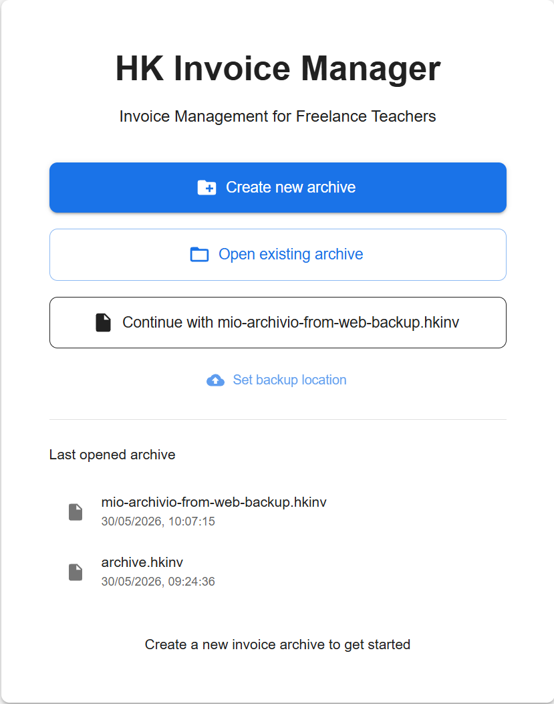
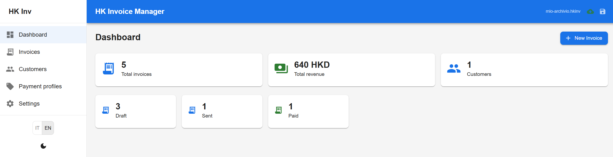
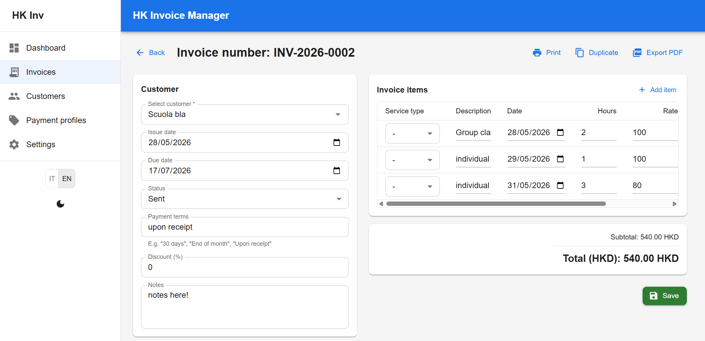

# HK Invoice Manager

Invoice management for freelance teachers in Hong Kong. Browser-based web app to create, manage, and export HKD invoices for lessons at private schools. Compliant with Hong Kong IRD requirements. Bilingual Italian/English.

## Features

### Invoices
- Create invoices pre-filled from the previous one (customer, line items structure)
- Dynamic line items with description, date, hours, hourly rate — amount calculated automatically
- Percentage discount on subtotal
- Status workflow: Draft → Sent → Paid → Cancelled
- Duplicate any invoice with a new progressive number
- Combined filters by date range, customer, status, price range, invoice number
- Auto-numbering: `PREFIX-YEAR-XXXX` with a progressive counter

### Customers
- Full CRUD address book
- Customer detail page with invoice history
- Per-customer rate overrides on top of global rate cards

### Service Types
- Rate cards per service type: "Individual lesson", "Group lesson", "Workshop"
- Each profile has: name, default description, hourly rate, default hours
- Selecting a service type auto-fills description, rate, and hours when adding line items
- Override any rate per customer

### Teacher Profile
- Name, address, email, phone
- Business Registration Number (optional — required by some HK schools)
- Customizable invoice prefix
- Default payment terms
- Bank details for PDF output

### PDF Export
- Professional A4 layout with "FATTURA"/"INVOICE" header (matches UI language)
- Supplier info (teacher data + BR number if set)
- Customer info
- Line items table: description, date, hours, rate, amount
- Subtotal, discount, total in HKD
- Payment terms and bank details in footer

### Internationalization
- Full Italian and English translations (200+ keys each)
- Instant toggle from the sidebar
- Language persists across restarts
- PDF follows the selected UI language

### Data Storage & Backup
- Primary storage: **OPFS** (Origin Private File System) in your browser
- Optional backup: save a `.hkinv` file to your Documents folder
- **Auto-backup every 5 minutes** to your backup file (when configured)
- Manual save button always available in the toolbar
- Open any `.hkinv` file to import it into the browser

### Dark Mode
- Toggle light/dark theme from the sidebar

## Screenshots

<p align="center">
  &nbsp;
  
</p>

<p align="center">
  
</p>

## Tech Stack

| Layer | Technology |
|-------|-----------|
| Frontend | React 19, TypeScript, MUI v9 |
| Database | sql.js 1.11 (SQLite via WASM) |
| PDF | jsPDF 4 + jspdf-autotable |
| i18n | react-i18next + i18next |
| Routing | react-router-dom v7 (HashRouter) |
| Build | Vite 6 |
| Tests | Vitest (196 unit tests) |

## Quick Start (Windows)

Download the latest `hkinv-webapp.zip` from the [releases page](https://github.com/cento/hkinv/releases), extract it, and double-click `hkinv.bat`. The browser opens with the app running on `http://localhost:5173`.

No installation required — the launcher uses PowerShell's built-in TCP server (included in Windows 10/11).

### If Windows or PowerShell blocks the app

1. **Before downloading**: Windows SmartScreen may warn about the `.zip` file. Click **"More info"** → **"Keep anyway"**.

2. **After extracting**: if `hkinv.bat` doesn't start the server, PowerShell execution policy might be blocking it. Open the extracted folder, right-click `hkinv.bat` → **"Run with PowerShell"**, then allow it once prompted.

3. **Firewall**: if the browser shows "connection refused", Windows Firewall might be asking permission. Click **"Allow access"** for PowerShell.

4. **After stopping**: close the PowerShell window that `hkinv.bat` opened, or press `Ctrl+C` inside it. The browser tab can be closed normally.

## Development

```powershell
git clone https://github.com/cento/hkinv.git
cd hkinv
npm install
npm run dev
```

The app opens in your browser at `http://localhost:5173`.

## Scripts

| Command | Description |
|---------|-------------|
| `npm run dev` | Start dev server with hot reload |
| `npm run build` | Type-check and build to `dist/` |
| `npm run preview` | Preview production build locally |
| `npm run test:unit` | Run unit tests (Vitest) |
| `npm run lint` | Run ESLint |

## First Run

1. Open the app (see Quick Start above)
2. Click **"Create new archive"** to start fresh
3. Fill in the teacher profile
4. Start adding customers and invoices

Already have a `.hkinv` file? Use **"Open archive"** to import it. You can optionally set a **backup location** to keep a copy in your Documents folder.

## Data Portability

All data lives in your browser's OPFS (Origin Private File System). You can:

- **Export**: click the save icon in the toolbar to write a `.hkinv` file to your Documents
- **Import**: use "Open archive" on the welcome page to load any `.hkinv` file
- **Backup**: configure a backup location to auto-sync every 5 minutes

The `.hkinv` file is a standard SQLite database — portable across any device.

## Hong Kong Invoice Compliance

Hong Kong has no mandatory invoice format (no VAT/GST). For a freelance sole proprietor, an IRD-compliant invoice includes:

| Field | Source |
|-------|--------|
| "Invoice" heading | PDF header |
| Unique invoice number | `invoice_number` |
| Issue date | `issue_date` |
| Supplier name/address | `settings` |
| Customer name/address | `customers` |
| Service description | `invoice_items` |
| Amount in HKD | `total` |
| Payment terms | `payment_terms` |
| BR Number (optional) | `settings.br_number` |

Record retention: 7 years (IRD requirement).

## License

MIT
